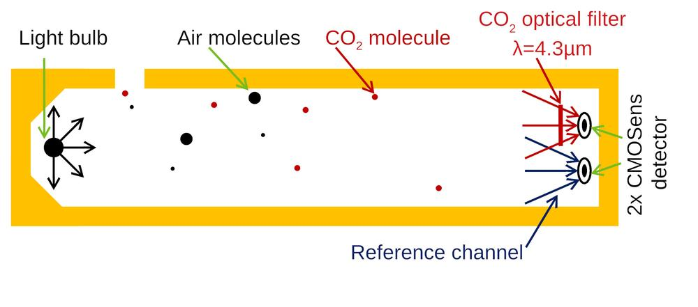
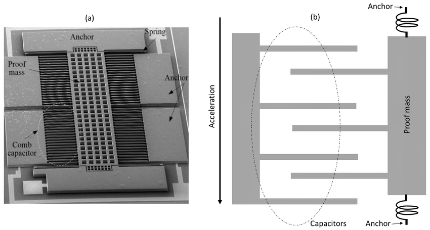
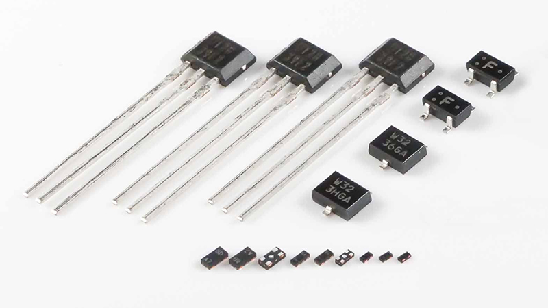
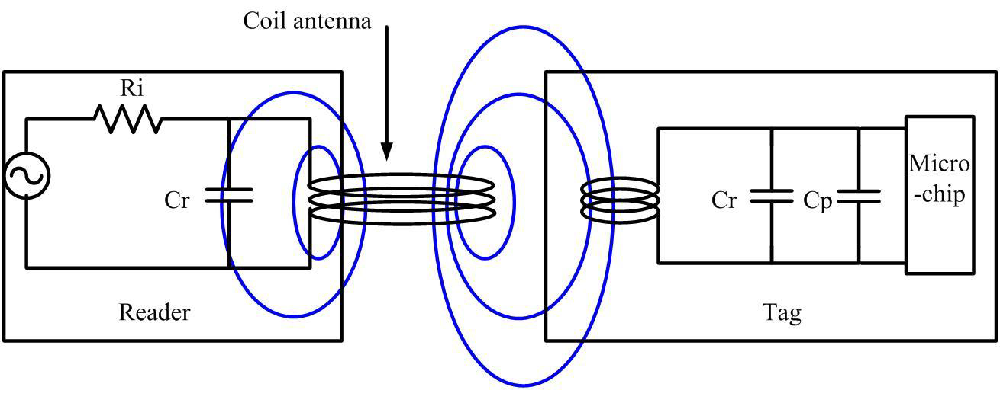
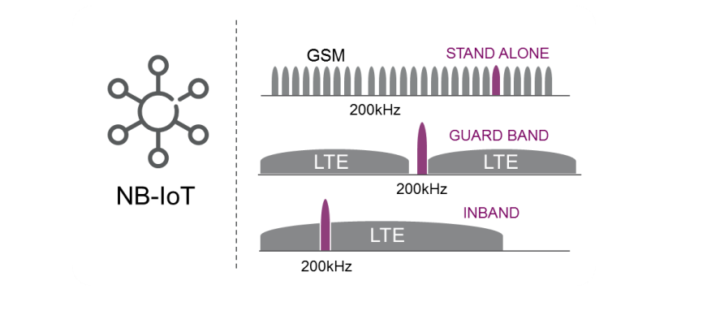
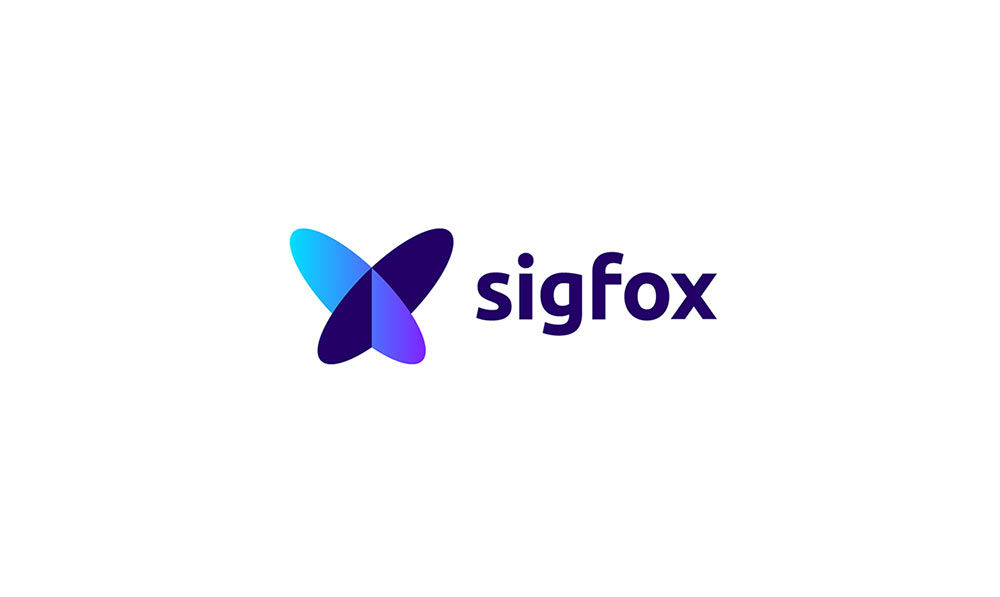
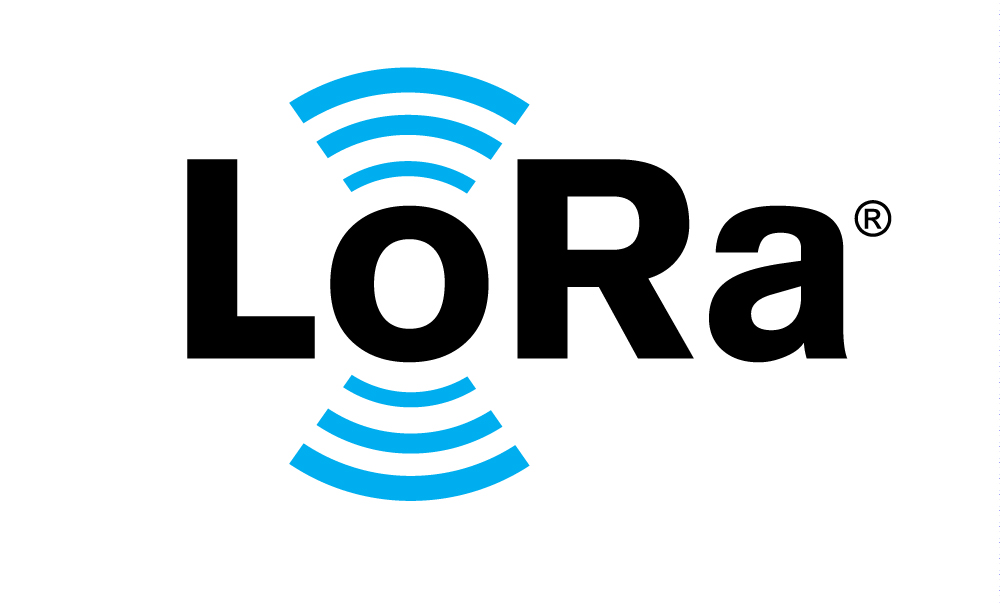
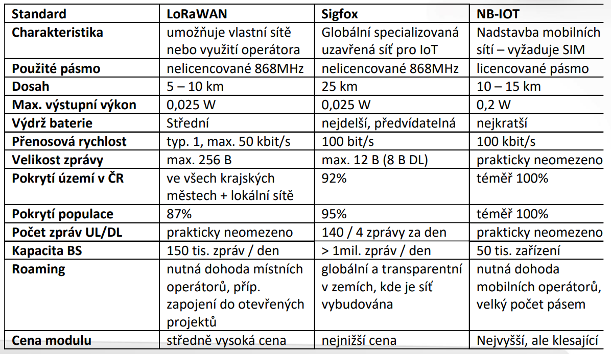
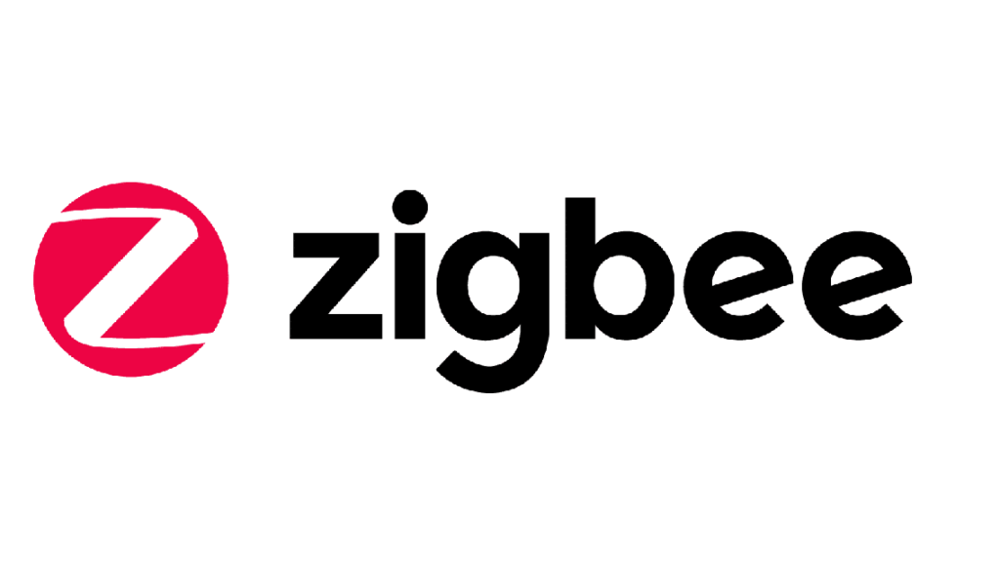
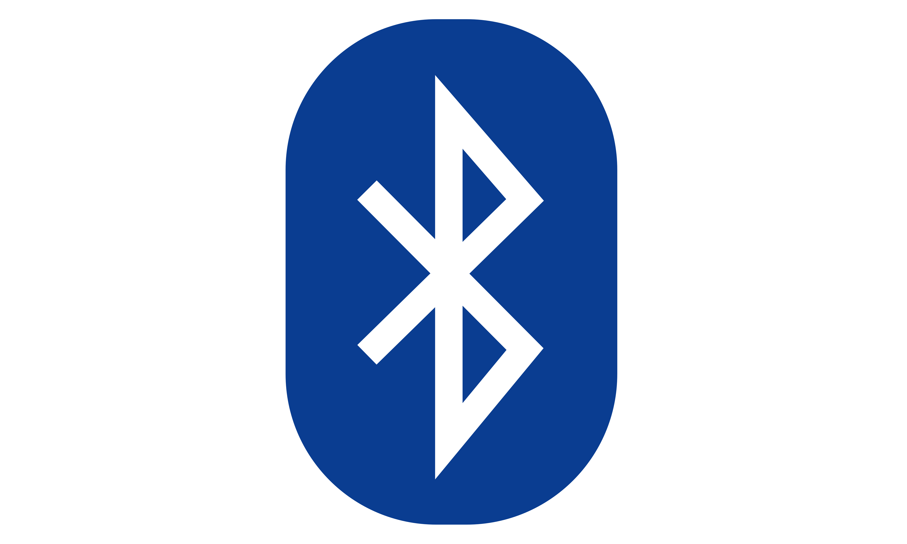

# IoT & AI

---

<!-- 
footer:  ""
paginate: true
-->

# Obsah
- očekávání
- IoT
- AI
- diskuze

<!-- 

# NOTES

- IoT
  - co to je
  - celkove schema, od hardware az po vizualizace a zpracovani dat
    - fyzikalni signal -> interpretovatelna informace (senzory, RFID tagy)
    - napeti -> prevod na digitalni podobu (MCU)
      - typy modulu
      - setreni energie
    - zpracovani dat a odeslani do koncentratoru (sit)
      - zpusoby pripojeni na internet (NB-IoT, ZigBee, Sigfox, LoRa a LoRaWAN, WiFi)
      - protokoly (MQTT, ESPNOW, HTTP, SSH)
    - efektivni sbirani dat, jejich zpracovani, filtrovani
    - tezba dat (vizualizace, aplikace, rozhodovani)
  - trendy
    - Prumysl 4.0
    - Digital Twins
    - Bezpečnost
  - co nabizi Azure pro IoT

- AI
  - co to je
  - jak funguje
  - zakladni modely
  - co nabizi Azure pro AI
  - diskuze nad danou problematikou

 -->

---

# Vaše očekávání

---

<!--
footer: IoT: Úvod
-->

# Co vše je IoT

- domácí spotřebiče (lednička, rychlovarka, ...)
- samoobslužná prodejna
- klasický nákupák (Tesco, Globus, Kaufland, Lidl, ...)
- chytré hodinky
- automatizovaná výrobní linka, sklad, nemocniční lůžko...

---

# Internet of things

- zařízení (MCU, spotřebiče, auta, ...)
- komunikace
- *těžba dat*

<!--
Co to tedy vlastne je?
- sit zarizeni, ktere mezi sebou dokazou komunikovat
- nejcasteji pomoci zprav

Ma smysl se IoT věnovat?
- 
-->

---

<!-- footer: IoT: Vrstvy -->
# Vrstvy IoT

- Fyzikální -> Signál (senzory)
- zpracování signálu (MCU)
- síťová (vysílání)
- informace -> znalost (těžba)

<!-- 
# Vrstvy IoT
Rozdelil jsem si sam, neni nijako standartizovano
- Fyzikální -> Signál (senzory)
  - úvod do problematiky - zdá se jednoduché, není, dle mého nejkomplikovanější část
- el. napětí -> digitální (MCU)
  - převod, lockin detekce, PWM, ...
  - typy používaných modulů a zařízení
- lokální -> globální (síť)
  - technologie pro připojení k internetu (NB-IoT, ZigBee, Sigfox, LoRa a LoRaWAN, WiFi)
  - protokoly (MQTT, ESPNOW, HTTP, SSH)
- informace -> znalost (těžba)
  - vizualizce (Elastic Stack)
  - AI a cviceni dat
  - akce

-->

---

## 1. Fyzikální -> Signál

- snímač, čidlo, převodník, detektor | RFID tag
- signál (napěťový, proudový, číslicový)
- dělení
  - pasivní x aktivní
  - výstup: analogový / číslicový / dvoustavový

---

## 1. Fyzikální -> Signál

- měřená veličina
  - mechanické a tepelné
  - optické a jaderné
  - el. a mag. veličiny
  - chemické a bio, akustické, ...
- technologie
  - polovodičová
  - MEMS (Micro Electro-Mechanical Systems)
  - tenkovrstvé a tlustovrstvé, integrovaný senzor, ...

---

## 1. Fyzikální -> Signál

- kasický měřící vzorec
  - senzor (snímač)
  - měřící obvod a zesilovač
  - obvod pro zpracování signálu
  - MCU

---

## 1. Fyzikální -> Signál
### CO2 senzor

---

## 1. Fyzikální -> Signál
### Lineární zrychlení (akcelerometr) (MEMS)

---
## 1. Fyzikální -> Signál
### Hallovy senzory

---
## 1. Fyzikální -> Signál
### RFID tag

---

## 2. Zpracování signálu

- A/D převodník
- PWM modulace
- zlepšení hodnot (lock-in detekce, ...)
- problematika spotřeby energie
- OS, RT systems (Linux, FreeRTOS, WxWorks, ...)

---

## 2. Zpracování signálu
### Moduly a mikrokontroléry

- výkonější
  - PC
  - Raspberry
  - FPGA
- muduly a mikrokontroléry
  - ESP32, ESP8266
  - Raspberry PI Pico W
  - CC3200 nebo CC3220 (Texas Instruments), ATSAMW25 (Microchip), ...
  
---

## 3. Síťová
- energetická náročnost
- rozdílné požadavky
- typické hiearchické uspořádání
- bezdrátové / drátové připojení do sítě

---

## 3. Síťová
### Technologie

- střední dosah
  - NB-IoT
  - Sigfox
  - LoRa
- malý dosah
  - ZigBee
  - Wi-Fi
  - Bluetooth

---

## 3. Síťová
### Narrowband IoT

- využívá již vybudovanou infrastrukturu mobilních sítí
- OFDM modulace
- přenosová rychlost dle verze 16 - 150 kbit/s
- vzdálenost 10 - 15 km

---

## 3. Síťová
### Sigfox

- globální **uzavřená** síť
- nelicencované pásmo 868 MHz
- *ekonomické problémy*
- omezené množství zpráv
- dosah 25 km

---

## 3. Síťová
### LoRa a LoRaWAN

- globální **otevřená** síť
- nelicencované pásmo 868 MHz
- LoRa vs. LoRaWAN
- dosah 5 - 10 km

---
<!-- footer: "" 
paginate: false
backgroundColor: "#FFF"
-->

---
<!-- footer: "IoT: Vrstvy" 
paginate: true
backgroundColor: "#000"
-->

## 3. Síťová
### ZigBee

- senzorové, domácí a průmyslové sítě
- vzdálenost 75 m
- nelicencovaná pasmá 868 MHz a 2.4 GHz
- přenosová rychlost 20, 40 250 kbit/s

---
## 3. Síťová
### IEEE 802.11

- specializované módy pro IoT řeší problematiku kolize
- krátký dosah
- energetický náročný
- veliké množství dat

---
## 3. Síťová
### IEEE 802.15

- bezdrátová náhrada RS-232
- PAN malý dosah *(verze 5.0 více jak 200 m)*
- ve verzi 5.0 až 255 bajtů na jednu zprávu

---
## Chci feedback!

