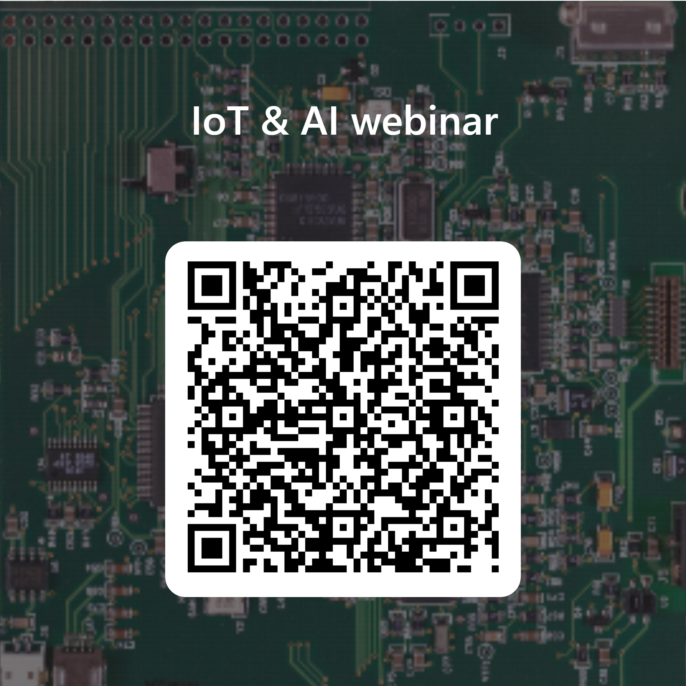

# IoT & AI

---

<!-- 
footer:  ""

-->

# Obsah
- očekávání
- IoT
- AI
- diskuze

<!-- 

# NOTES

- IoT
  - co to je
  - celkove schema, od hardware az po vizualizace a zpracovani dat
    - fyzikalni signal -> interpretovatelna informace (senzory, RFID tagy)
    - napeti -> prevod na digitalni podobu (MCU)
      - typy modulu
      - setreni energie
    - zpracovani dat a odeslani do koncentratoru (sit)
      - zpusoby pripojeni na internet (NB-IoT, ZigBee, Sigfox, LoRa a LoRaWAN, WiFi)
      - protokoly (MQTT, ESPNOW, HTTP, SSH)
    - efektivni sbirani dat, jejich zpracovani, filtrovani
    - tezba dat (vizualizace, aplikace, rozhodovani)
  - trendy
    - Prumysl 4.0
    - Digital Twins
    - Bezpečnost
  - co nabizi Azure pro IoT

- AI
  - co to je
  - jak funguje
  - zakladni modely
  - co nabizi Azure pro AI
  - diskuze nad danou problematikou

 -->

---

# Vaše očekávání

---

<!--
footer: IoT: Úvod
-->

# Co vše je IoT

- domácí spotřebiče (lednička, rychlovarka, ...)
- samoobslužná prodejna
- klasický nákupák (Tesco, Globus, Kaufland, Lidl, ...)
- chytré hodinky
- automatizovaná výrobní linka, sklad, nemocniční lůžko...

---

# Internet of things

- zařízení (MCU, spotřebiče, auta, ...)
- komunikace
- *těžba dat*

<!--
Co to tedy vlastne je?
- sit zarizeni, ktere mezi sebou dokazou komunikovat
- nejcasteji pomoci zprav

Ma smysl se IoT věnovat?
- 
-->

---

<!-- footer: IoT: Vrstvy -->
# Vrstvy IoT

- fyzikální -> signál (senzory)
- el. napětí -> digitální (MCU)
- lokální -> globální (síť)
- informace -> znalost (těžba)

<!-- 
# Vrstvy IoT
Rozdelil jsem si sam, neni nijako standartizovano
- fyzikální -> signál (senzory)
  - úvod do problematiky - zdá se jednoduché, není, dle mého nejkomplikovanější část
- el. napětí -> digitální (MCU)
  - převod, lockin detekce, PWM, ...
  - typy používaných modulů a zařízení
- lokální -> globální (síť)
  - technologie pro připojení k internetu (NB-IoT, ZigBee, Sigfox, LoRa a LoRaWAN, WiFi)
  - protokoly (MQTT, ESPNOW, HTTP, SSH)
- informace -> znalost (těžba)
  - vizualizce (Elastic Stack)
  - AI a cviceni dat
  - akce

-->

---

## 1. fyzikální -> signál

- snímač, čidlo, převodník, detektor | RFID tag
- signál (napěťový, proudový, číslicový)
- dělení
  - pasivní x aktivní
  - výstup: analogový / číslicový / dvoustavový

---

## 1. fyzikální -> signál

- měřená veličina
  - mechanické a tepelné
  - optické a jaderné
  - el. a mag. veličiny
  - chemické a bio, akustické, ...
- technologie
  - polovodičová
  - MEMS (Micro Electro-Mechanical Systems)
  - tenkovrstvé a tlustovrstvé, integrovaný senzor, ...

---

## 1. fyzikální -> signál

- kasický měřící vzorec
  - senzor (snímač)
  - měřící obvod a zesilovač
  - obvod pro zpracování signálu
  - MCU

---

## 1. fyzikální -> signál
### CO2 senzor

---

## 1. fyzikální -> signál
### Lineární zrychlení (akcelerometr) (MEMS)

---
## 1. fyzikální -> signál
### Hallovy senzory

---
## 1. fyzikální -> signál
### RFID tag

---
## Chci feedback!

